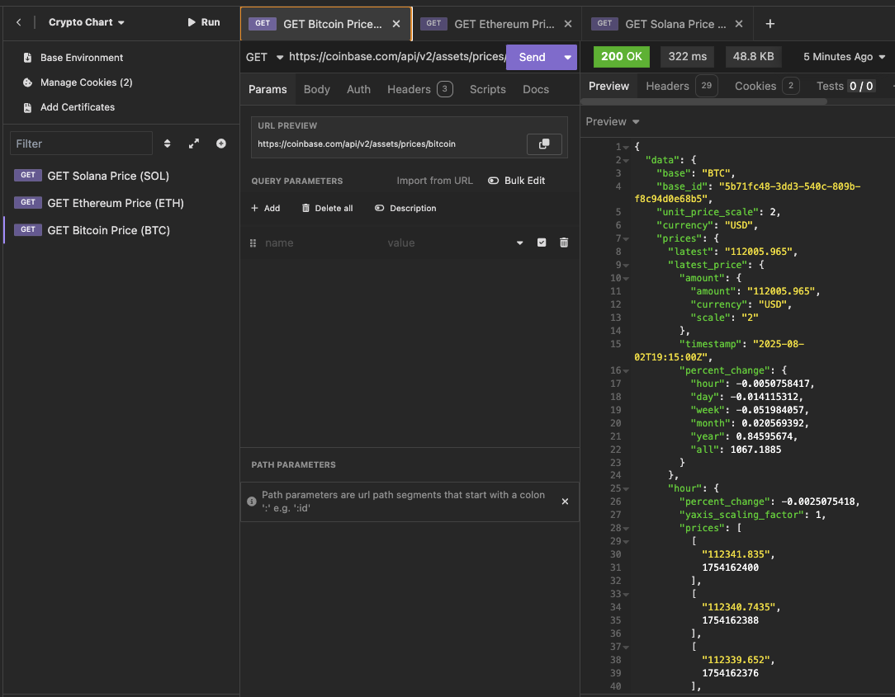
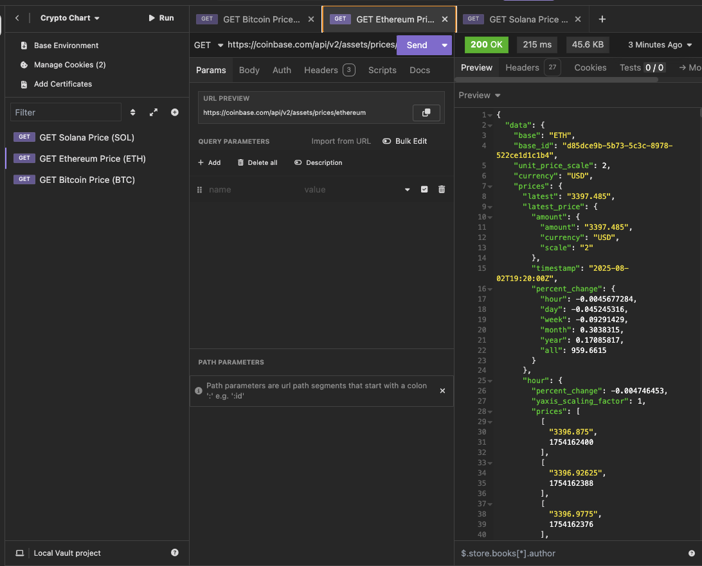
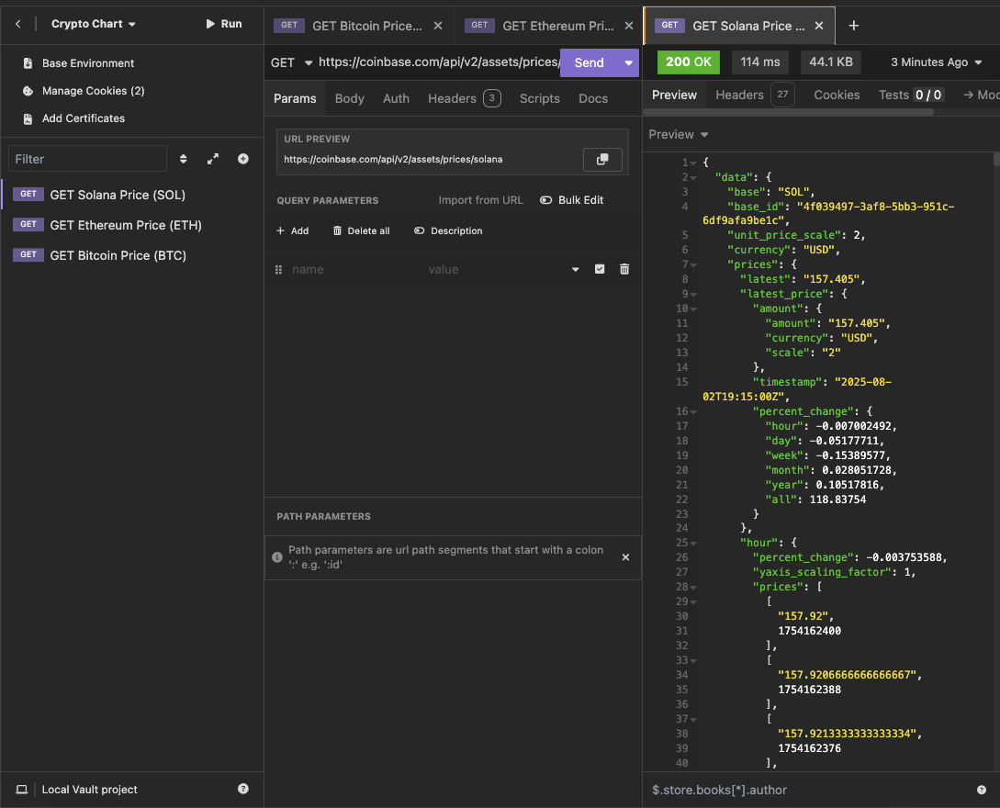
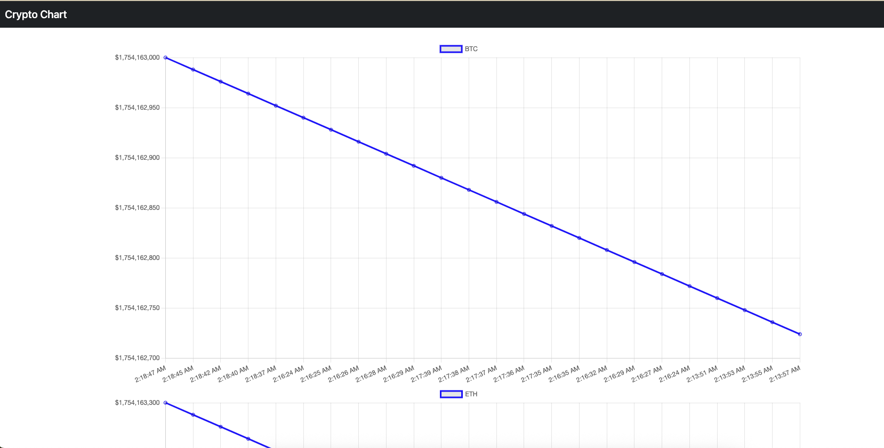

## API Testing & Chart Rendering Verification

#### Bitcoin


#### Ethereum


#### Solana


#### Chart Output Preview


# 📈 Crypto Chart with Axios and Chart.js

This beginner-friendly project teaches you how to use **Axios** to fetch cryptocurrency prices and display them using **Chart.js**. You’ll also learn how to use `Promise.all`, the difference between `axios.create()` and `axios.get()`, and how `async/await` fits in.

---

## 🧠 What You'll Learn

- 🔌 How to use **Axios** to talk to APIs
- ⏳ What **async/await** means and how it makes code easier to read
- 🤝 What **Promise.all** does and why it’s useful for multiple requests
- 📊 How to draw graphs using **Chart.js**
- 🧱 How to dynamically manipulate the DOM in JavaScript

---

## 🔄 Why use `async/await` with Axios?

**Imagine** you're ordering food 🥡 online:
- You place the order (`axios.get()`), and wait for the delivery.
- You don’t want to cook in the meantime—you’ll wait and do other things once it arrives.

That’s what `async/await` does:
- `await` says: "Pause here until the data comes back."
- It lets you write asynchronous code that reads like step-by-step instructions.

In this project:
```js
const response = await api.get('/bitcoin');
```
This means we *wait* for the data before trying to use it—just like waiting for your food before setting the table.

---

## 🔗 What is `axios.create()` vs `axios.get()`?

### 🍽️ `axios.get()`: Walk to the store every time.
```js
axios.get("https://coinbase.com/api/v2/assets/prices/bitcoin");
```

### 🚗 `axios.create()`: Set up your own delivery driver with a base address.
```js
const api = axios.create({
  baseURL: "https://coinbase.com/api/v2/assets/prices",
});
api.get("/bitcoin");
api.get("/ethereum");
```

Instead of typing the full URL every time, we set a **baseURL** once and only write the endpoints. It's cleaner, especially when making multiple requests.

---

## 🤝 What is `Promise.all()`?

Imagine sending **two friends** to buy Bitcoin and Ethereum prices at the same time.

```js
const results = await Promise.all([getBitcoin(), getEthereum()]);
```

Instead of waiting for one to return before sending the other, you send both at once. Then wait for both to return together.

This makes our app **faster** and more **efficient**.

---

## 📈 What is Chart.js?

Chart.js is like a digital **whiteboard artist** 🎨. You give it:
- Labels (times)
- Data (prices)
- Style (colors)

And it draws beautiful graphs for you.

In this project, we give it real-time crypto data to draw line graphs that auto-update every 10 seconds.

---

## How It Works Together

- We fetch live data using **Axios** with a reusable instance (`axios.create()`).
- We wait for data using `async/await`, keeping the code clean and readable.
- We get data for multiple coins at once using `Promise.all()`.
- We draw everything with **Chart.js** inside the DOM.

---

## Practice Checklist

✅ Learn how to connect to an API  
✅ Practice writing `async` functions  
✅ Build charts dynamically  
✅ Update charts in real-time  
✅ Understand how async workflows really operate

Now go build your own live dashboards! 🚀💸
